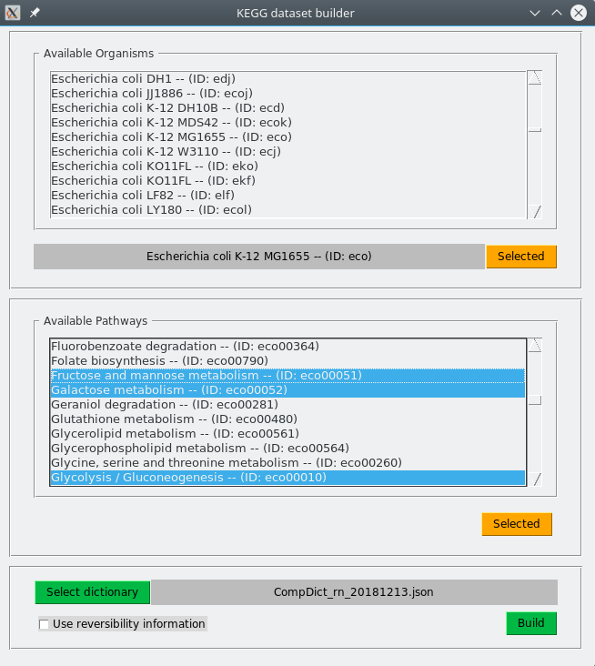
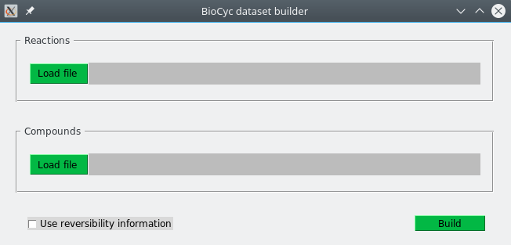
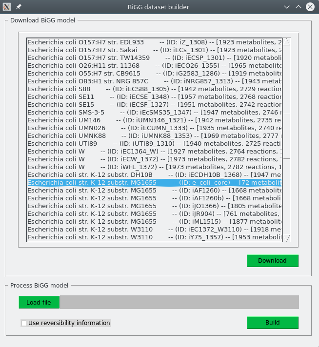

# PhDSeeker: Pheromone-Directed Seeker for metabolic pathways

**VERSION**: 2.0

**UPDATE**:  25-09-2020.

**AUTHORS**: Matias F. Gerard, Raúl N. Comelli

**URL**: [http://sinc.unl.edu.ar/web-demo/phds/](http://sinc.unl.edu.ar/web-demo/phds/)


---


## **DESCRIPTION:**

Pheromone Directed Seeker (PhDSeeker) is a tool based on a bio-inspired algorithm for the automatic synthesis of linear and branched feasible metabolic pathways [[1]](https://doi.org/10.1038/s41598-018-34454-z). It allows relating several compounds simultaneously, ensuring the availability of the substrates for every reaction in the solution.

This tool is provided with a command line interface, but also with an easy-to-use graphical user interface. A set of auxiliary tools for building the datasets are also supplied.

While examples and auxiliary tools provided are for [KEGG](https://www.genome.jp/kegg/), [BioCyc](https://biocyc.org/) and [BiGG](http://bigg.ucsd.edu/) databases, this tool can be used with any user-defined dataset.


---

## **CONTENTS**

1. [REQUIREMENTS AND INSTALLATION](#requirements-and-installation)
2. [SOURCE CODE ORGANIZATION](#source-code-organization)
3. [DATASET PREPARATION](#dataset-preparation)
4. [SETTINGS](#settings)
5. [PATHWAYS VISUALIZATION](#pathways-visualization)
6. [RUNNING AN EXAMPLE WITH COMMAND LINE OR GUI](#running-an-example-with-command-line-or-gui)


---


## REQUIREMENTS AND INSTALLATION

PhDSeeker was written and tested on Python 2.7 and 3.5. However, in newer versions it could also work.

This tool was implemented using mainly the Standard Library of Python [STL], and only a few additional packages:

* argparse        [STL]
* codecs          [STL]
* copy            [STL]
* datetime        [STL]
* json            [STL]
* multiprocessing [STL]
* numpy           [>=1.13.0]
* os              [STL]
* re              [STL]
* requests        [>=2.18.0]
* scipy           [>=0.18.1]
* sys             [STL]
* timeit          [STL]
* time            [STL]
* urllib3         [>=1.22]
* webbrowser      [STL]
* yaml            [PyYAML>=3.11]


Only `numpy`, `scipy` and `PyYAML` need to be installed to work with PhDSeeker in command-line. `requests` and `urllib3` are required for using auxiliary tools. For simplicity, a `requirements.txt` file is provided for installing all dependencies. Installation can be done using the following command:

```console
>> pip install -r requirements.txt
```

For using tools with graphical user interface (GUI), check for availability of `tkinter` module in your Python distribution by running `python -m tkinter` from the command line. It should open a window showing a simple Tk interface, letting you know that `tkinter` is correctly installed on your system. If this module is not available, follow the instructions to [install Tk](https://tkdocs.com/tutorial/install.html) for Pyhton on your system.


Once all requirements are installed, PhDSeeker can be used directly by downloading and unziping the [`PhDSeeker-2.0.zip`](https://sourceforge.net/projects/sourcesinc/files/phdseeker/) file or by cloning this: [repository](https://github.com/sinc-lab/phdseeker). Check Python's site for indications to install [Python](https://www.python.org/) and [pip](https://pip.pypa.io/en/stable/installing/). Check the official documentation for a quick introduction to Python.


---

### USAGE

The following instruction should be typed to execute this tool in command line mode:

```console
>> python phdseeker.py --settings <configuration_file.yaml>
```

For example:
```console
>> python phdseeker.py --settings config/SETTINGS_KEGG_glycolysis.yaml
```

where the `SETTINGS_KEGG_glycolysis.yaml` file contains the experimental settings. Section [SETTINGS](#settings) explains how to make this file. PhDSeeker can be launched in GUI mode with the following command:

```console
>> python phdseeker-gui.py
```

An example using both, command-line and GUI-based interfaces, is shown in Section [RUNNING AN EXAMPLE WITH COMMAND LINE OR GUI](#running-an-example-with-command-line-or-gui).


---


## SOURCE CODE ORGANIZATION

The source code is organized as follows:

```
.
+-- config/
|   +-- SETTINGS_KEGG_glycolysis.yaml
|
+-- db/
|   +-- BiGG/
|   +-- BioCyc/
|   +-- KEGG/
|       +-- CompDict_rn_20181213.json
|       +-- ENZYMES_rn_20181213.txt
|       +-- NAMES_rn_20181213.txt
|       +-- REACTIONS_rn-1pathway_20181213.txt
|
|   +-- BiGG2PHDSFiles-gui.py
|   +-- BiGG2PHDSFiles.py
|   +-- BioCyc2PHDSFiles-gui.py
|   +-- BioCyc2PHDSFiles.py
|   +-- KEGG2PHDSFiles-gui.py
|   +-- KEGG2PHDSFiles.py
|
+-- lib/
|   +-- libPhDSeeker.py
|   +-- template.html
|
+-- out/
|
+-- screenshots/
|
+-- SupMat/
|   +-- Section 2 - Simple pathway linking 2 compounds/
|   +-- Section 3 - Complex pathway linking several compounds/
|   +-- Section 4 - Design of metabolic pathways with industrial applications/
|
+-- phdseeker-gui.py
+-- phdseeker.py
+-- README.md
+-- requirements.txt
```

The `config/` folder is reserved for storing experimental configuration files; `lib/` folder contains the `libPhDSeeker.py` file with classes and functions that are the core of PhDSeeker, and `template.html` file includes all the elements for drawing and manipulating pathways; the `out/` folder is used to store experiments' results; the `db/` folder stores the datasets and auxiliary functions to build them from [KEGG](https://www.genome.jp/kegg/), [BioCyc](https://biocyc.org/) and [BiGG](http://bigg.ucsd.edu/) databases. Datasets building is described in Section [DATASET PREPARATION](#dataset-preparation). The `SupMat/` folder includes the settings and outputs files for experiments presented in Supplementary Material [2], and `screenshots/` contains screenshots of the GUI for each tool.


---


## DATASET PREPARATION

Reactions datasets are tipically stored as plain text files, and are named as `REACTIONS_<name>.txt` (for convenience). Each reaction is stored with a *reaction name* followed by the chemical equation, describing every substrate and product as a couple: *stoichiometric coefficient-compound*. **Note that compound names should not include white spaces**. Reactions can be stored taking into account their reversibility. One-direction reactions are indicated with a left-to-right arrow ` --> `, and reversible ones with ` <=> `.

For example, the following reversible reaction (belonging to KEGG - [link](http://www.genome.jp/dbget-bin/www_bget?rn:R00097)):

```console
R00097: 1 C00080 + 1 C00003 + 2 C00001 + 2 C00541 <=> 1 C00004 + 2 C00992
```

is splitted in two semireactions:

```console
-- forward reaction --

R00097: 1 C00080 + 1 C00003 + 2 C00001 + 2 C00541 --> 1 C00004 + 2 C00992

-- reverse reaction --

R00097: 1 C00004 + 2 C00992 --> 1 C00080 + 1 C00003 + 2 C00001 + 2 C00541
```

Note that in *reverse reaction*, substrates and products are exchanged respect *forward direction* to preserve the left-to-right arrow.

>**Despite datasets can be manually build to include reactions from different sources as long as the indicated format is respected** (for example, reactions from [BRENDA](https://www.brenda-enzymes.org/) database can be used to build manually a specific dataset), 3 command-line tools (also GUI interfaces are available) are provided together with PhDSeeker in order to facilitate the construction of reactions datasets.


### KEGG Database
    
`KEGG2PHDSFiles.py` and `KEGG2PHDSFiles-gui.py` (GUI-based version) allow to automatically build the **REACTIONS**, **COMPOUNDS NAMES**, and **ENZYMES** files from the REST service that provides accession to the KEGG database. Those files are tipically stored in the `db/KEGG/` folder. The command-line tool to build them accepts 4 options:

```console
'--organism'               ---> Organism for which the database is to be built. This must be specified following the KEGG notation. i.e. E coli --> 'eco'. By default, the full reactions dataset "rn" is downloaded.

'--pathways'               ---> Pathways to be taken into account to build the dataset. By default, all the pathways in the organism are used.
                       
'--use_reversibility_info' ---> Boolean value indicating if reactions should be considered always as reversible [True/False]. By default, this parameter is False.
                       
'--usedict'                ---> Path to the JSON file that stores the dictionary to translate KEGG codes into compound names. If this parameter is not specified, the dictionary is automatically built and saved for further uses.
```

Some typical cases of use are shown below.

```console
>> python KEGG2PHDSFiles.py
```

This command builds the **REACTIONS**, **ENZYMES** and **COMPOUND NAMES** files taking into account all reactions in KEGG, and stores reactions with the direction indicated in the KGML files for this organism. The compounds dictionary to translate KEGG codes is also built.


```console
>> python KEGG2PHDSFiles.py --organism eco
```

This command builds the **REACTIONS**, **ENZYMES** and **COMPOUND NAMES** files taking into account only reactions for *Escherichia coli*, and stores reactions with the direction indicated in the KGML files for this organism. Compounds dictionary to translate KEGG codes is also built.


```console
>> python KEGG2PHDSFiles.py --organism eco --pathways eco00010,eco00020
```

This command builds the **REACTIONS**, **ENZYMES** and **COMPOUND NAMES** files taking into account only reactions for *Escherichia coli*, and stores reactions with the direction indicated in the KGML files for pathways eco00010 (Glycolysis / Gluconeogenesis) and eco00020 (TCA cycle) for this organism. Compounds dictionary to translate KEGG codes is also built.


```console
>> python KEGG2PHDSFiles.py --organism eco --use_reversibility_info True
```

This command builds the **REACTIONS**, **ENZYMES** and **COMPOUND NAMES** files taking into account only reactions for *Escherichia coli*, and stores every reaction as reversible. Compounds dictionary to translate KEGG codes is built.


```console
>> python KEGG2PHDSFiles.py --organism eco --use_reversibility_info True --usedict KEGG/CompDict_rn_20181213.json
```

This command builds the **REACTIONS**, **ENZYMES** and **COMPOUND NAMES** files taking into account only reactions for *Escherichia coli*, and stores every reaction as reversible. The compounds dictionary stored in the `db/KEGG/` directory is used to translate KEGG codes (no new dictionary is built).


The GUI-based version of this tool can be launched by executing:

```console
>> python KEGG2PHDSFiles-gui.py
```

The same options than for the command-line version are also available. The image below is a screenshot of the GUI.


Building a dataset involves three steps:

1. Top panel (*Available organisms*): Select an organism (it is also possible to choose a generic organism merging all organisms in KEGG).

2. Middle panel (*Available pathways*): Select pathways from which to extract reactions to build the dataset.

3. Bottom panel: Indicates if reversibility of reactions should be taken into account. Optionally, a JSON file with information to translate database identifiers to compounds names can be specified. This file is automatically build if no file is indicated (this process can take a few minutes, so the use of a pre-built file is recommended).

Once completed these steps, dataset is build automatically by pressing *Built* button. Here below is an example of a dataset build for *E. coli* using pathways *eco00010*, *eco00051* and *eco00052* (KEGG identifiers). A JSON file (*CompDict_rn_20181213.json*) to translate compounds identifiers is also specified.




### BioCyc Database

`BioCyc2PHDSFiles.py` and `BioCyc2PHDSFiles-gui.py` allow to automatically build the **REACTIONS**, **ENZYMES** and **COMPOUND NAMES** files from BioCyc `compounds.dat` and `reactions.dat` files for a given version of the database. An example of these files is available at:

```console
compounds.dat --> http://bioinformatics.ai.sri.com/ptools/flatfile-samples/compounds.dat

reactions.dat --> http://bioinformatics.ai.sri.com/ptools/flatfile-samples/reactions.dat
```

> **Please note that the use of BioCyc files requires an agreement licence that is not provided with PhDSeeker. Consult the BioCyc website for more information.**


    
Files are tipically stored in the `db/BioCyc/` folder. This tool accepts 3 parameters:

```console
'--cpdDB'                  ---> Path to the "compounds.dat" file for the organism for which the database is to be built.

'--rxnDB'                  ---> Path to the "reactions.dat" file for the organism for which the database is to be built.
                       
'--use_reversibility_info' ---> Boolean value indicating if reactions should be taken always as reversible [True/False]. By default, this parameter is False.
```


Some typical cases of use are shown below.

```console
>> python BioCyc2PHDSFiles.py --cpdDB BioCyc/EcoCyc_21.5-compounds.dat --rxnDB BioCyc/EcoCyc_21.5-reactions.dat --use_reversibility_info True
```

This command builds the **REACTIONS**, **ENZYMES** and **COMPOUND NAMES** files for the EcoCyc v21.5 database, without taking into account reversibility of reactions.

```console
>> python BioCyc2PHDSFiles.py --cpdDB BioCyc/MetaCyc_21.5-compounds.dat --rxnDB BioCyc/MetaCyc_21.5-reactions.dat --use_reversibility_info False
```

This command builds the **REACTIONS**, **ENZYMES** and **COMPOUND NAMES** files for the MetaCyc v21.5 database taking into account reversibility of reactions.


The GUI-based version of this tool can be launched by executing:

```console
>> python BioCyc2PHDSFiles-gui.py
```

The same options than for the command-line version are also available. The same reactions and compounds files required for command-line version should be provided here. A screenshot of the GUI is shown below:




### BiGG Database

`BiGG2PHDSFiles.py` and `BiGG2PHDSFiles-gui.py` allow to automatically build the **REACTIONS**, **COMPOUNDS NAMES**, and **ENZYMES** files from a JSON file describing a BiGG model. Files are stored in the `db/BiGG/` directory. This accept 2 parameters:

```console
'--file'                   ---> JSON file with the model for the chosen organism.
                       
'--use_reversibility_info' ---> Boolean value indicating if reactions should be taken always as reversible [True/False]. By default, this parameter is False.
```

Some typical cases of use are shown below.

```console
>> python BiGG2PHDSFiles.py --file BiGG/iJO1366.json
```

This command builds the **REACTIONS**, **ENZYMES** and **COMPOUND NAMES** files from the *Escherichia coli* model iJO1366. Direction of reactions (forward, reverse or both) is determined from lower and upper bounds for each reaction. If the model does not include information of enzymes, an empty **ENZYMES** file is built.

```console
>> python BiGG2PHDSFiles.py --file BiGG/iJO1366.json --use_reversibility_info True
```

This command builds the **REACTIONS**, **ENZYMES** and **COMPOUND NAMES** files from the *Escherichia coli* model iJO1366, and stores every reaction as reversible (upper and lower bounds for reactions are not taken into account). If the model does not include information of enzymes, an empty **ENZYMES** file is built.

**NOTE**: Boundary reactions are not included in the reactions database.


The GUI-based version of this tool can be launched by executing:

```console
>> python BiGG2PHDSFiles-gui.py
```

Below is available a screenshot of the grafical interface.





The same options than for the command-line version are also available. However, unlike the command-line, this interface allows to download a model for an organism (top panel, *Download BiGG model*) or to process a given one (bottom panel, *Process BiGG model*) as an independent tasks. If you already have a model, it is also possible to process it and build the dataset whith this tool.


---


## SETTINGS

Experimental settings can be specified in an intuitive way directly in the graphical interface (see the end of this Section), or with a settings file if PhDSeeker is run in command line mode. Configuration files are stored in the `config/` folder. It is possible to define several files specifying different subset of reactions (e.g. one for each organism) and indicate which one should be used in the `config/SETTINGS_<name>.yaml` file. A typical configuration file is provided as an example. Every file involves three blocks of information: main, database and compounds. They are described in the following sections.

Please note that it is possible to perform the search under different initial conditions by modifying the sets of compounds and algorithm parameters. Moreover, new datasets can be build by following the structure of `REACTIONS_<name>.txt` files.


### MAIN SETTINGS

This block specifies general configurations for the tool and the ant-based algorithm (see [[1]](https://doi.org/10.1038/s41598-018-34454-z) for details).

```yaml
# GENERAL SETTINGS
 - NCORES                    ---> Number of cores to perform the search.
 
 - Verbose                   ---> Indicates if the algorithm must show a summary of the search on every iteration.

 
 # ALGORITHM SETTINGS
 - Nants                     ---> Number of ants used to perform the search.
 
 - rho                       ---> Evaporation rate.
 
 - maxIterations             ---> Maximum allowed number of iterations for the experiment.
 
 - IterationsWithoutChanges  ---> Maximum allowed number of iterations without changes on the best solution.
 
 - IterationsWithAlignedAnts ---> Minimum number of iterations where all the ants follow the same path.
 
 - StrictInitialization      ---> Indicates if the algorithm must use as initial reactions only those that are feasible from the provided compounds, or if it can automatically include additional compounds to perform the search.
 
 - AllowExternalCompounds    ---> Indicates if the algorithm must include, as freely availables, all those compounds which cannot be synthesized by any reaction in the dataset.
```


### DATASET SETTINGS

This block specifies paths for the reactions dataset, the enzymes file and the compound names used in the current search.

```yaml
 - REACTIONS  ---> path to the file containing the set of reactions used in the search. See Section 3 for a description of the structure of the reactions' database.

 - ENZYMES    ---> path to the file containing enzymes catalyzing each reaction (OPTIONAL). See Section 3.4 for details.

 - COMPNAMES  ---> path to the file containing names for each compound in the reactions' database (OPTIONAL). This is used to visualize reactions if compounds are identified with a particular encoding (i.e. KEGG codes). See Section 3.4 for details.
```

While **REACTIONS** file is required to perform the search, **ENZYMES** and **COMPNAMES** are optional and do not necessarily need to be specified in the settings file. Regarless, if **ENZYMES** and **COMPNAMES** are not defined, information associated to them will not be available.

Information of *enzymes* and *compound name* encoding can be also specified using two additional files. This information is only used for visualization purpouses, and can be ommited. 

**ENZYMES** information is stored in `ENZYMES_<name>.txt` file. Each row shows the following structure.

```console
<reaction name>: <EC number "1">, <EC number "2">, <EC number "3">, ...
```

where `<reaction name>` corresponds to the name of a given reaction in the reactions dataset, and `<EC number>` is the numerical classification scheme for the enzyme. The code `"-.-.-.-"` will be automatically assigned to reactions for which this information is not available. A typical record for a reaction (extracted from KEGG) is:

```console
R00014: 1.2.4.1, 2.2.1.6, 4.1.1.1
```

**COMPOUND NAMES** information is tipically stored in `NAMES_<name>.txt` file. Each row shows the following structure.

```console
<compound code>: <compound name>
```

where `<compound code>` is the code used for compounds in the reactions dataset, and `<compound name>` is one of the possible names by which the compound is known. A typical record for a compound name (KEGG compound encoding) is:

```console
C00022: Pyruvate
```


### COMPOUNDS SETTINGS

This block describes the compounds involved in the search. There are two sets:

```yaml
 - abundant ---> freely available compounds (for example H2O, ATP, NAD).

 - relate   ---> compounds among which to find a pathway.
```

Compounds to relate must be specified by adding the following structure for each new compound:

```console
 -
   compound: \<compound code> (for example C00118)
   initial: <yes/no> (indicates if it must be used as initial substrate in the search)
```

For example, given three compounds C00001, C00002, C00003 and the following configuration:

```yaml
-
  compound: C00001
  initial: yes
-
  compound: C00002
  initial: no
-
  compound: C00003
  initial: yes
```

only C00001 and C00003 can be used as initial substrates. A complete example of this block could be as follows:

```yaml
 #------------------------------------------------------------------------------
 COMPOUNDS:
    
    abundant: [C00001, C00002, C00003, C00004, C00005, C00006, C00007, C00008, C00009, C00010, C00080]

     relate:
        -
         compound: C00103 # D-Glucose-1-phosphate
         initial: yes
        -
         compound: C00631 # 2-Phospho-D-glycerate
         initial: no
```


Similarly, configuration of PhDSeeker in graphical mode follows the same steps. A screenshot of the GUI is shown below:


The GUI consists of three main sections: SETTINGS, RESULTS and VIEWER.

SETTINGS section groups all the elements that must be specified to perform a search (the same as in a typical settings file). It is composed of three subsections (as in the settings file): ALGORITHM, DATASET, COMPOUNDS.

- ALGORITHM subsection allows to specify general configurations for the tool and the ant-based algorithm.


- DATASET subsection allows to select the reactions dataset, the files with information of enzymes catalyzing each reaction, and the file containing the name of every compound in the reactions' dataset. Although, only the reactions dataset is required for the operation of PhDSeeker and it is not necessary to provide the compound names and enzyme files. However, these files provide information that is subsequently used in the visualization to enrich the representation of the solutions. In particular, the compound names file is used by the GUI to facilitate the selection of the different groups of compounds using their names instead of their identifiers. 


- COMPOUNDS subsection allows to specify the set of abundant compounds, compounds to relate and compounds that can be used as source for searching the pathway. On each case, pressing *Select* button opens a new window to select the compounds from a list sorted alphabetically. A screenshot of this window is shown below.


RESULTS section contains three buttons to quickly show the results of the process. Pathways button opens the dynamic visualization in the default web browser. The VIEWER section allows to visualize, inside the GUI, the content of summary and history files. Even though results are stored in the `out/` folder, a window to select a different detination folder is opened when the *Run* button is press.

> Every element in the GUI is provided with a tooltip (pop-up box with help information), displayed when the mouse is over each element.


---


## PATHWAYS VISUALIZATION
Visualization is based on d3 JavaScript library (www.d3js.org). Metabolic pathways found can be visualized by opening the web page `out/<name of the experiment>.html` with Firefox or Chrome. For interactive visualization, we recomend Mozilla Firefox® (www.mozilla.com) Version 26 or later, or Google Chrome® (https://www.google.com/intl/en/chrome/browser) Version 30 or later.


Metabolic pathways are shown with the following set of lines and colors:

```console
- red        ----> initial substrate
- yellow     ----> compounds to be produced from initial substrate
- blue       ----> reactions/enzymes
- light blue ----> compounds produced in the pathway (intermediates)
- green      ----> abundant compounds
- purple     ----> external compounds

- solid      ----> substrate of the reaction
- dashed     ----> product of the reaction
```

The stoichiometric coefficient is also indicated for each substrate/product. The web representation can be manipulated to rearrange the elements of the metabolic pathway using the mouse. To unlock a node it is necessary to `double-click` on it with the left mouse button. Additional features (e.g. activating/deactivating groups of compounds) can be accessed through the menu in the top-left corner of the web page. An example of pathway visualization is shown below.


A contextual menu is activated by double-clicking with the left button on the compounds or reactions/enzymes while pressing `SHIFT key`. For compounds, links to [PubChem](https://pubchem.ncbi.nlm.nih.gov/) and [BioCyc](https://biocyc.org/) databases with information of the selected metabolite are available in the contextual menu. When **ENZYMES** file is provided, the information of the enzymes that catalyze each reaction is incorparated into the representation. In cases where the reaction can be catalyzed by two or more enzymes, only one enzyme is shown together with the `+` symbol. In all cases, links lead to the corresponding web page for the enzyme in [BRENDA](https://www.brenda-enzymes.org/) database.

    
---


## RUNNING AN EXAMPLE WITH COMMAND LINE OR GUI

A simple example can be run using the files provided in the `db/KEGG/` folder and the following specifications for the settings file (provided in `config/` folder):


```yaml
---
 
 NCORES: 1                                                # NUMBER OF CORES USED TO PARALLELIZE
 
 Nants: 10                                                # NUMBER OF ANTS PER ANTHILL
 
 rho: 0.1                                                 # EVAPORATION RATE
 
 maxIterations: 200                                       # MAXIMUM NUMBER OF ITERATIONS
 
 IterationsWithoutChanges: 20                             # MINIMUM NUMBER OF CONSECUTIVE ITERATIONS WITHOUT CHANGES IN THE BEST SOLUTION
 
 IterationsWithAlignedAnts: 10                            # NUMBER OF CONSECUTIVE ITERATIONS WITH ALL ANTS FOLLOWING THE SAME SOLUTION
 
 StrictInitialization: False                              # IF "TRUE", IT FORCES THE ALGORITHM TO USE ONLY FEASIBLE INITIAL REACTIONS FROM THE PROVIDED SUBSTRATES
 
 AllowExternalCompounds: True                             # IF "TRUE", IT ALLOWS THE ALGORITHM TO INCLUDE AS FREELY AVAILABLE COMPOUNDS ALL THOSE WHICH CANNOT BE SYNTHESIZED BY ANY REACTION
 
 Verbose: True                                            # IF "TRUE", A DETAIL OF THE SEARCHING PROCESS IS SHOWN.
 
 #---------------------------------------------------------------------------------------------------------
 
 REACTIONS: db/KEGG/REACTIONS_rn-1pathway_20181213.txt    # REACTIONS USED FOR THE SEARCH
 
 ENZYMES: db/KEGG/ENZYMES_rn_20181213.txt                 # ENZYME CODES
 
 COMPNAMES: db/KEGG/NAMES_rn_20181213.txt                 # COMPOUND NAMES
 
 #---------------------------------------------------------------------------------------------------------
 
 COMPOUNDS:
 
     abundant: [C00001, C00002, C00003, C00004, C00005, C00006, C00007, C00008, C00009, C00010, C00080]
     
     relate:
        -
         compound: C00103 # D-Glucose-1-phosphate
         initial: yes
        -
         compound: C00631 # 2-Phospho-D-glycerate
         initial: no
```

PhDSeeker can be run using the command-line interface with the following command:

```console
>> python phdseeker.py --settings config/SETTINGS_KEGG_glycolysis.yaml
```

Results will be stored in the `out/` folder. The GUI-based interface can be launched by typing the following command:

```console
>> python phdseeker-gui.py
```

The same configuration can be specified in the GUI, as shown below. The search starts by pressing the *Run* button, previously selecting the destination folder (pop-up window). By default, `out/` folder is selected.


---


> *Disclaimer: Authors are not responsible for the inapropiate use of PhDSeeker or the provided auxiliary tools, nor are they responsible for any damages that may be caused by the use of these tools.*
>
> **Licence**: This project is licensed under the GNU General Public Licence.

---
References:
---

[1] Gerard M.F, Stegmayer G., Milone D.H., "*Metabolic pathways synthesis based on ant colony optimization*", (2018) Sci. Rep., 8, 16398 ([DOI: 10.1038/s41598-018-34454-z](https://doi.org/10.1038/s41598-018-34454-z)).

[2] Gerard M.F, Comelli, R.N., "*PhDSeeker: Pheromone-Directed Seeker for Metabolic Pathways*", (2020) BioSystems, 198, 104259 ([DOI: 10.1016/j.biosystems.2020.104259](https://doi.org/10.1016/j.biosystems.2020.104259))
